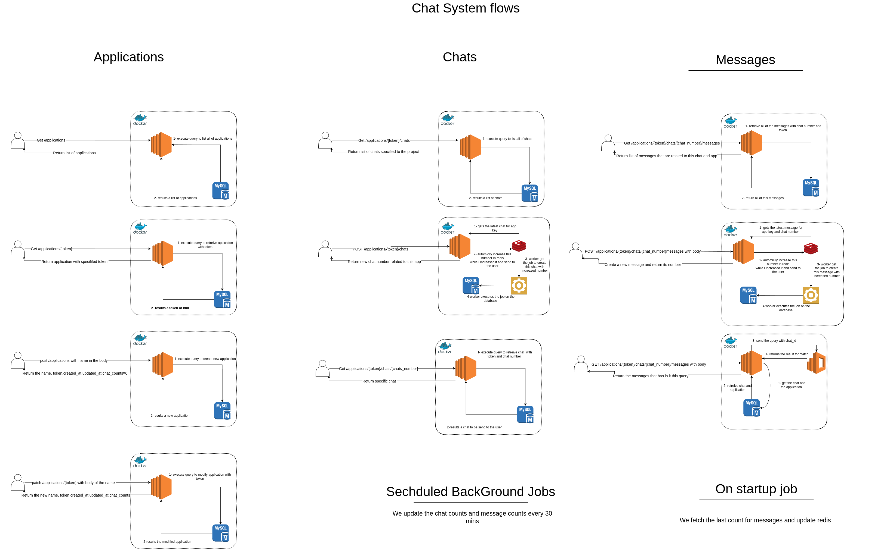

# README

First of all I would like to thank you so much for giving me the chance for this opportunity 

Things you may want to cover:

# API Endpoints

## Applications

### Create Application
- **Endpoint:** `POST /applications`
- **Description:** Creates a new application.
- **Parameters:** 
  - `name` (required): The name of the application.

### Show Application
- **Endpoint:** `GET /applications/:token`
- **Description:** Retrieves a specific application by its token.
- **Parameters:** 
  - `token` (required): The token of the application.

### List Applications
- **Endpoint:** `GET /applications`
- **Description:** Retrieves a list of all applications.

### Update Application
- **Endpoint:** `PUT /applications/:token`
- **Description:** Updates a specific application by its token.
- **Parameters:** 
  - `token` (required): The token of the application.
  - `name` (optional): The new name of the application.

## Chats

### Create Chat
- **Endpoint:** `POST /applications/:application_token/chats`
- **Description:** Creates a new chat for a specific application.
- **Parameters:** 
  - `application_token` (required): The token of the application.

### List Chats
- **Endpoint:** `GET /applications/:application_token/chats`
- **Description:** Retrieves a list of all chats for a specific application.
- **Parameters:** 
  - `application_token` (required): The token of the application.

### Show Chat
- **Endpoint:** `GET /applications/:application_token/chats/:number`
- **Description:** Retrieves a specific chat by its number for a specific application.
- **Parameters:** 
  - `application_token` (required): The token of the application.
  - `number` (required): The number of the chat.

## Messages

### Create Message
- **Endpoint:** `POST /applications/:application_token/chats/:chat_number/messages`
- **Description:** Creates a new message for a specific chat in a specific application.
- **Parameters:** 
  - `application_token` (required): The token of the application.
  - `chat_number` (required): The number of the chat.
  - `body` (required): The body of the message.

### List Messages
- **Endpoint:** `GET /applications/:application_token/chats/:chat_number/messages`
- **Description:** Retrieves a list of all messages for a specific chat in a specific application.
- **Parameters:** 
  - `application_token` (required): The token of the application.
  - `chat_number` (required): The number of the chat.

### Search Messages
- **Endpoint:** `GET /applications/:application_token/chats/:chat_number/messages/search`
- **Description:** Searches for messages in a specific chat in a specific application.
- **Parameters:** 
  - `application_token` (required): The token of the application.
  - `chat_number` (required): The number of the chat.
  - `query` (required): The search query.

* System design



* Testing 

After making sure that you ran 
```bash
docker-compose up --build
```
and you have the image already built please run
```bash
docker-compose run --rm -e RAILS_ENV=test web bundle exec rspec;
```

* Deployment instructions
After running this command 
```bash 
docker-compose up --build
```
You can go to the browser on [here](http://127.0.0.1:3000/api-docs)

You will find detailed examples and endpoints 

# Important notes:
1- regularly we would make all of the hosts and any other variable to be configurable as environment variable and we would make .env.example but for the ease of use and not having enough time I hard coded them 
<br>
2- regards the bonus of building the creation for messages and chats we could have used locks if we wanted it to be the only service with kafka or redis for consuming the messages from the main service    

### Finally thank you again for your time! Please don't hesitate to contact me anytime.
